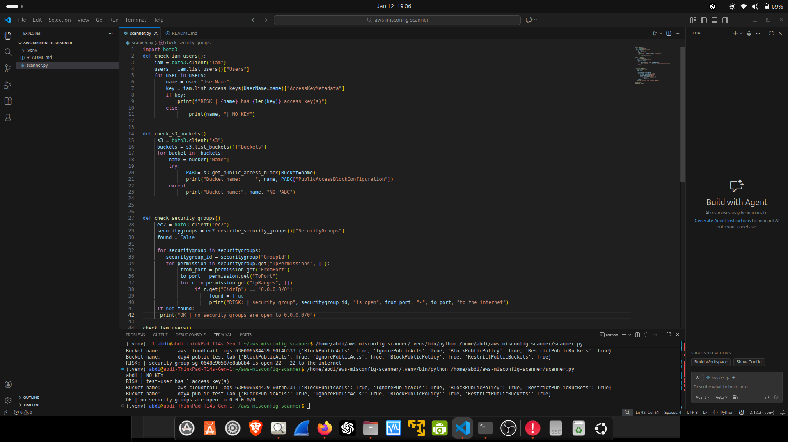
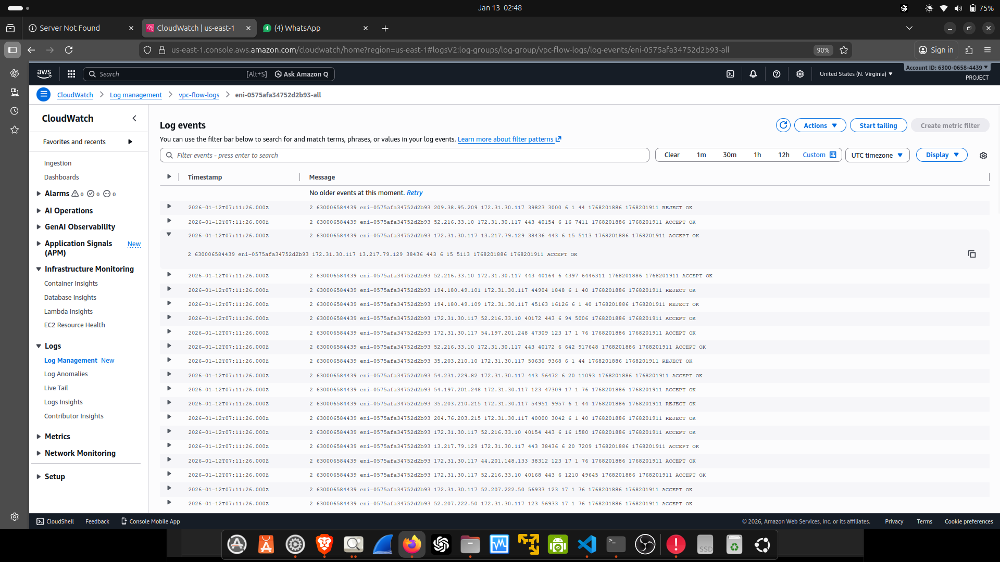
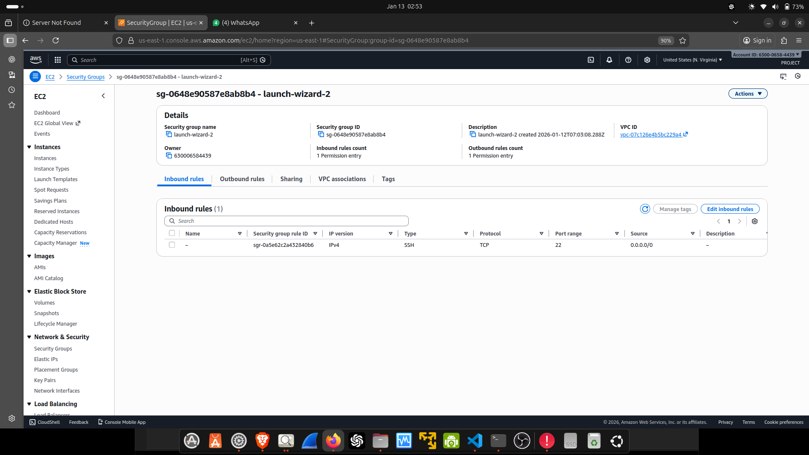
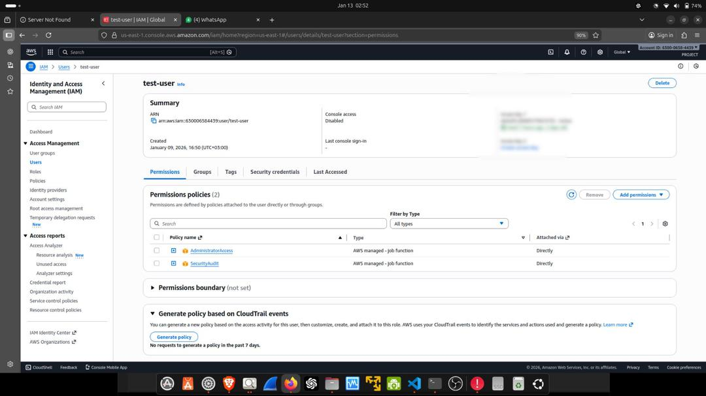

# AWS Misconfiguration Scanner

A lightweight Python-based AWS security auditing tool that detects common cloud misconfigurations across IAM, S3, EC2 Security Groups, and supports investigation using CloudTrail and VPC Flow Logs.

This project demonstrates hands-on cloud security monitoring, misconfiguration detection, and investigation workflows aligned with SOC and junior cloud security roles.

---

## Features

- Detect IAM users with active access keys
- Review S3 bucket public access block configuration
- Identify EC2 security groups open to 0.0.0.0/0
- Support investigation using:
  - AWS CloudTrail events
  - VPC Flow Logs

---

## Script Output Example

The scanner detects risky configurations in real time:

---

## VPC Flow Logs (Network Traffic Monitoring)

Example VPC Flow Log entries showing ACCEPT and REJECT traffic at the network layer:

---

## Security Group Misconfiguration

Inbound rule exposing SSH (port 22) to the internet (0.0.0.0/0):

---

## IAM User & Access Key Review

Detection of IAM users with active access keys (keys redacted for security):

---

## Technologies Used

- Python (boto3)
- AWS IAM
- AWS S3
- AWS EC2
- AWS CloudTrail
- AWS VPC Flow Logs

---

## Why This Project Matters

This project reflects real-world cloud security responsibilities:
- Identifying misconfigurations
- Investigating suspicious activity
- Understanding identity, network, and logging controls
- Supporting SOC-style detection and triage workflows

---

## Disclaimer

All sensitive data (account IDs, access keys, IPs) has been redacted.  
This project is for educational and demonstration purposes only.
